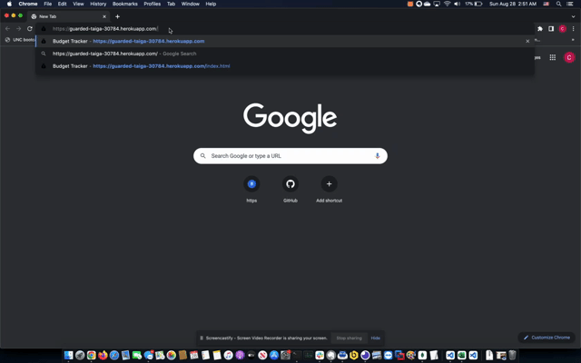

  
# Project Title - Budget-Tracker

repo - https://github.com/roo116/budget-tracker
application - https://guarded-taiga-30784.herokuapp.com/
  
  
## Project Description
Web-based and Progressive Web app that tracks income and expenses. 

This application is built with the following technologies:
[MondoDB](https://www.mongodb.com/), [mongoose](https://mongoosejs.com/), [express](https://expressjs.com), [morgan](https://www.npmjs.com/package/morgan) and [compression](https://www.npmjs.com/package/compression).
  
## Table of Contents
  - [Installation](#installation)
  - [Usage](#usage)
  - [License](#license)
  - [Contributing](#contributing)
  - [Tests](#tests)
  - [Questions](#questions)
  
## Installation
Connect to https://guarded-taiga-30784.herokuapp.com/
To install PWA click the download icon in the address bar of your browser.

 

  
## Usage
1. connect to or open the application
2. Input income and click add funds.
3. Input expenses and click subtrack funds.

 

  
## License
This is licensed under the MIT license. See the badge for the link to the license information.
  
## Tests

  
## Questions
If you have questions, reach out via email or GitHub  
Gitub:  [GitHub Repository](https//github.com/roo116)  
Email:  hillkarl03@gmail.com  
  